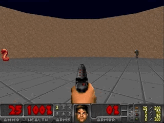
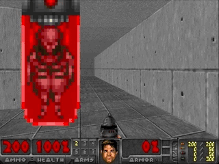

# DoomLab

DoomLab is a Doom-based suite for deep reinforcement learning.

## Environments

The environments are developed based on [VizDoom](https://github.com/mwydmuch/ViZDoom). 

### Generalization on Levels

It consists of 4 scenarios and each scenario organises environments according to difficulty levels. The code for running some experiments is in [LevDoom](https://github.com/TTomilin/LevDoom).

Examples:



We modify the environment characteristics with the goal of changing their visual appearance. Most of the variations we introduce (e.g., textures, entity size, agent height, rendering mode) would not increase difficulty for human players. However, some modifications (e.g., entity type, obstacles) may have a subtle effect on the game mechanics. The proposed modifications include the following:
- Introducing new enemy and item types.
- Rendering enemies and items in a different shape, size, or style.
- Applying noisier textures, which increase the challenge of distinguishing the relevant enemies or items from the background.
-  Adding decorations to the environment, which either act as obstacles by hindering the navigation of the agent, or confuse the agent as being potential relevant targets.
- Varying the height of the agent, which vertically shifts the plain of view.

Environments with different levels are as follows:

DefendTheCenter
```
  Level0:
    - default
  Level1:
    - fast_enemies
    - flying_enemies
    - fuzzy_enemies
    - gore
    - mossy_bricks
    - resized_enemies
    - stone_wall
  Level2:
    - gore_mossy_bricks
    - resized_fuzzy_enemies
    - stone_wall_flying_enemies
  Level3:
    - fast_resized_enemies_gore
    - gore_stone_wall_fuzzy_enemies
    - resized_flying_enemies_mossy_bricks
  Level4:
    - allinone
```

### Continual Learning

We provide a sequence of four tasks/environments.

Examples:



RunAndGun
```
- default
- red
- blue
- shadows
```

Todo:

Language

DA

## Install

Please follow the installation document of [VizDoom](https://github.com/mwydmuch/ViZDoom/blob/master/doc/Building.md). Or simply install like: (tested on python==3.6)
```bash
$ conda install -c conda-forge boost cmake gtk2 sdl2
$ git clone https://github.com/mwydmuch/ViZDoom.git --recurse-submodules
$ cd ViZDoom
$ python setup.py build && python setup.py install
```


Then installing DoomLab is simple.
```bash
$ cd DoomLab
$ pip install -e .
```

## How to use

```bash
$ python tests/test_DefendTheCenter_level.py --level 2
```

## List of publications

- [LevDoom: A Benchmark for Generalization on Level Difficulty in Reinforcement Learning](https://ieee-cog.org/2022/assets/papers/paper_30.pdf) (CoG 2022)

```bib
@inproceedings{tomilin2022levdoom,
  title     = {LevDoom: A Benchmark for Generalization on Level Difficulty in Reinforcement Learning},
  author    = {Tristan Tomilin and Tianhong Dai and Meng Fang and Mykola Pechenizkiy},
  booktitle = {In Proceedings of the IEEE Conference on Games},
  year      = {2022}
}
```

## Acknowledgements

The code for DoomLab was originally based on Tristan Tomilin's master thesis project advised by Meng Fang. The authors are also grateful for the open source project [VizDoom](https://github.com/mwydmuch/ViZDoom) and its developers.